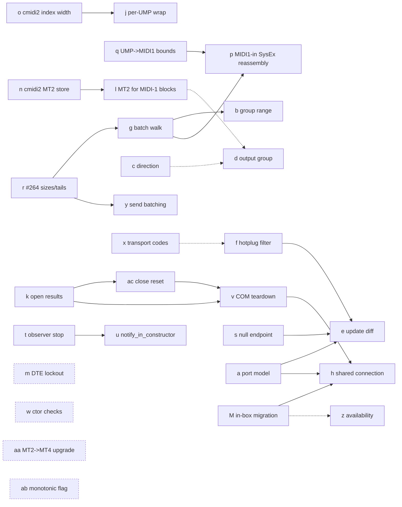

# libremidi winmidi backend: defect audit at upstream HEAD

Date: 2026-10-03. Read-only audit. No repository was modified and nothing was pushed; the Libremidi4UE submodule was only read and diffed.

Builds on earlier internal research (the "prior research" below; not part of this repository) that ranked defects (a)–(k) against a Push 3 run. This audit re-verifies them at upstream HEAD, adds the defects found in a full pass over the backend and the conversion paths it uses, and lays out a fix order. Companions: [hardware probe evidence](audit-winmidi-probe-2026-10-03.md) and [upstream issue sweep](audit-winmidi-upstream-2026-10-03.md). Open items are tracked in [backlog.md](backlog.md).

---

## 0. Baselines

| Item | Value |
|---|---|
| Upstream HEAD audited | `celtera/libremidi` `master` = `5c839a5a669c792d6d86be50edcb4a85123f7603` (2026-09-28, "winmidi: convert input timestamps from MidiClock ticks to nanoseconds") |
| Libremidi4UE submodule pin | `67e8ccd97d4bdb6d0de634aec4425280f1ef0423` (2026-07-11), working tree clean, 36 commits behind HEAD |
| Pin → HEAD delta in audited files | Only `backends/winmidi/{helpers,midi_in,observer}.hpp` (+50 / −8): `5c839a5` (timestamps, = defect i), `968b5fa` (observer transport filter), `c5f20ea` (NOMINMAX guard). `cmidi2.hpp`, `detail/{conversion,midi_stream_decoder,ump_stream,midi_out}.hpp`, `midi_in.cpp`, `midi_out.cpp` are **identical** at pin and HEAD, so every conversion/decoder finding below applies to the pin too. |
| The owner's fork of libremidi | `master` 0 ahead / 51 behind upstream. `fix/winmidi-input-group-filter` and `fix/winmidi-timestamp-ns` are patch-equivalent to merged upstream commits (`git cherry` "-"). Other branches with unique commits are maintainer branches carried over at fork time. No owner delta. |
| Open upstream items touching this audit | #234 (COM batch drop, = g), #254 (GTB-only `get_port`, = a), #252 (in-box migration), #253 (WinMM handle), #200 (observer/virtual), PR **#264** (contributor PR: reserved UMP sizes + truncated-tail guards, = r), all open |
| Microsoft sources | `microsoft/MIDI` `main` `68f4345254` (in-box API; docs under `docs/`), tag `rc-4` (`src/app-sdk/winrt/*`, the SDK generation Libremidi4UE bundles today) |
| Translation library used by the service | `midi2-dev/AM_MIDI2.0Lib` ("libmidi2") `7fa1b0c` (vcpkg dependency of the UMP→bytestream transform) |

Path conventions: `W/` = `include/libremidi/backends/winmidi/`; `L/` = `include/libremidi/`. All `file:line` are at upstream HEAD unless marked "pin".

**Method.**
1. Full read of `W/*` (config, helpers, midi_in, midi_out, observer) and of every shared path they call: `L/detail/midi_stream_decoder.hpp`, `L/detail/ump_stream.hpp`, `L/detail/midi_out.hpp`, `L/detail/conversion.hpp`, `L/cmidi2.hpp` (MIDI 1 ⇄ UMP), `L/midi_in.cpp` (protocol wraps), `L/midi_out.cpp`, `L/detail/memory.hpp`.
2. Microsoft behaviour read from source (main and rc-4) and the published docs.
3. **Hardware-free probes** on macOS (Apple clang 21, header-only libremidi at HEAD, plain and `-fsanitize=address,undefined`), driving the real decoder/conversion code through the `rawio`/`rawio_ump` backends or the internal classes directly. Results are quoted per defect; the probe list is in Appendix A.
4. No Windows run. Anything that needs the WMS runtime is marked **[unverified]** or **[source-verified]** (read in Microsoft's source, not run).

---

## 1. Summary

**29 ids: 28 open, 1 fixed (i).**

| Severity | Count | Ids |
|---|---|---|
| Critical | 4 | d, g, m, o |
| High | 7 | a, c, j, l, p, q, r |
| Medium | 7 | b, e, k, s, v, w, aa |
| Low | 10 | f, h, n, t, u, x, y, z, ab, ac |
| Fixed at HEAD | 1 | i |

Severity scale. **Critical**: memory corruption or a hang reachable by ordinary traffic, or silent loss/misrouting of a whole message class on a common path. **High**: silent data loss or misrouting on a narrower but real path, or memory unsafety on a less common path. **Medium**: crash or UB under uncommon but real conditions (service restart, hot-plug race, teardown), or wrong semantics for a device class. **Low**: performance, cosmetics, latent bugs, misclassification.

**What changes relative to the prior research.**
- (a)–(h), (j), (k) are all still present at HEAD; (i) is fixed; (f) exists only at HEAD.
- **Four new Critical/High defects sit in the shared MIDI 1 ⇄ UMP conversion**, not in `W/`. They hit every caller that sends MIDI 1.0 *bytes* through winmidi (Libremidi4UE `SendMessage`, Blueprints), every MIDI 1 *input* opened on winmidi, and the WinMM fallback:
  - **(m)** after the standard "RPN Null" (CC101 127, CC100 127), every later message on that output, SysEx included, is dropped with an error until a CC 38 arrives. Probe-verified.
  - **(o)** a MIDI 1 SysEx of exactly 256 bytes (or 512, 768, ...) hangs the calling thread in an infinite loop; 257–49 151 bytes fail; above ~49 KB it overflows the heap. Probe-verified (hang, error, ASan).
  - **(l)** MIDI 1 bytes are sent as MIDI 2.0 protocol (MT4), and the service's translator turns a Note On velocity 0 (a note-off) into velocity 1 on every MIDI 1.0 device. Source-verified in Microsoft's transform and libmidi2. For example, a Push pad LED that should switch off lights in palette colour 1.
  - **(p)** a MIDI 1 input on winmidi delivers multi-packet SysEx as a corrupt `F0 <last packet's bytes> F7`. Probe-verified.
- **A UMP-only consumer's Push 3 path** (UMP in, UMP out) needs **d, g** (with **r** for memory safety) and benefits from **c, k**. It does not touch l/m/o/p, because it sends and receives UMP directly.
- **Policy correction for (g).** The prior sketch passes groupless messages through the group filter. Microsoft's porting guide says MT 0xF messages "must not be routed to a port". The fix should drop them on group-filtered ports (§3, g).

---

## 2. Overview table

"P3": Push 3 (USB MIDI 1.0 on the KSA transport, 3 cables, one group per Group Terminal Block (GTB), SysEx-heavy, driven by a UMP consumer). "1C": single-cable MIDI 1.0 device. "M2": MIDI 2.0 device or endpoint (USB MIDI 2.0, network, BLE 2.0, virtual). Relevance: **R** = required, r = affects, – = no effect. Effort is the estimated changed lines without tests.

| Id | Title | Sev | Location (HEAD) | Verified | P3 | 1C | M2 | Effort |
|---|---|---|---|---|---|---|---|---|
| a | `get_port` searches GTBs only; FB+GTB listed together; block number used as address | High | `W/helpers.hpp:67-91`; `W/observer.hpp:111,117,151-163,180-192,271-281` | source + upstream #254 | – | – | **R** | 40–80 |
| b | Multi-group block filtered to its first group | Med | `W/midi_in.hpp:112,208-213,243-248` | source | – | – | r | 6–10 |
| c | Block direction inverted | High | `W/observer.hpp:153,160,182,189,253-264` | MS doc+source; P3/UR44C numbering | r | **R** (asym.) | r | 6–10 |
| d | Output group never set (opened block's group ignored) | **Crit** | `W/midi_out.hpp:45-47,115-146,174-195`; `L/cmidi2.hpp:2630` | source + P3 run | **R** | – | r | 20–30 |
| e | Hot-plug `Updated` churns all ports; `IsActive`/update flags ignored | Med | `W/observer.hpp:205-214` | source | – | – | r | 30–50 |
| f | Transport filter not applied on hot-plug path | Low | `W/observer.hpp:223-269` (228, 241) | source | – | r | r | 4–6 |
| g | COM batch treated as one message; batch-level group verdict; groupless MTs mis-filtered; stack overflow >6 words | **Crit** | `W/midi_in.hpp:240-252`; `L/detail/midi_stream_decoder.hpp:468-471` | probe (ASan) + P3 log + #234 | **R** | **R** | **R** | 20–30 |
| h | One session and one connection per port | Low | `W/midi_in.hpp:75-77,117`; `W/midi_out.hpp:25-27,51`; `W/config.hpp:21,27` | MS doc | r | – | r | 150–250 |
| i | Timestamps in ticks, not ns | — | fixed by `5c839a5` | merged | — | — | — | 0 |
| j | MIDI 1 backend + UMP user: only the first UMP of a converted message delivered | High | `L/midi_in.cpp:36-58` (44-48) | probe | r (WinMM fallback) | r | – | 8–12 |
| k | Open-path results ignored (`Open()`, QI, `SetMessagesReceivedCallback`, `AddMessageProcessingPlugin`) | Med | `W/midi_in.hpp:129,131-133,136,167,177`; `W/midi_out.hpp:55,57,86,88` | MS doc+source | r | r | r | 15–25 |
| l | MIDI 1 bytes sent as MIDI 2.0 protocol (MT4); Note On vel 0 becomes vel 1 on MIDI 1.0 devices | High | `L/detail/midi_out.hpp:72-80`; `L/detail/conversion.hpp:289-293`; `L/cmidi2.hpp:2631,2783,2788` | probe + MS/libmidi2 source | r (Libremidi4UE `SendMessage`) | **R** | r | 6–12 |
| m | cmidi2 RPN/NRPN/DTE/bank state fails whole calls; RPN Null locks the output | **Crit** | `L/cmidi2.hpp:2795-2850,2935-2939` | probe | r (`SendMessage`) | **R** | r | 10–25 |
| n | cmidi2 MIDI1-protocol branch stores a 32-bit word into one byte | Low (latent; blocks l) | `L/cmidi2.hpp:2753-2768` | probe | – | – | – | 4 |
| o | cmidi2 MIDI1→UMP 8-bit index aliasing: SysEx ≥256 B fails, 256·k B hangs, >~49 KB heap overflow | **Crit** | `L/cmidi2.hpp:2698-2699,2718,2737`; `L/detail/conversion.hpp:264,295` | probe (hang, ASan) | r (`SendMessage`, WinMM fallback) | **R** | r | 6–10 |
| p | MIDI 1 user on winmidi: SysEx7 not reassembled across packets (corrupt `F0 <last> F7`) | High | `L/midi_in.cpp:13-33` (19-20); `L/cmidi2.hpp:3195,3247` | probe | r (Libremidi4UE Midi1 inputs) | **R** | r | 30–45 |
| q | cmidi2 UMP→MIDI1: SysEx7 accumulated in an unbounded 1024-byte stack buffer | High | `L/cmidi2.hpp:3146-3153,3195,3230-3241` | probe (ASan) | r (WinMM fallback send) | r | r | 8–15 |
| r | Reserved MT sizes `0xFF`; truncated-tail OOB in input walker and output segmenter; unbounded copy (= PR #264) | High | `L/cmidi2.hpp:350-366`; `L/detail/midi_stream_decoder.hpp:405-409,468-471`; `L/detail/ump_stream.hpp:35-55` | probe (ASan) | r | r | r | 0 (#264) / ~25 |
| s | `on_device_updated` dereferences a possibly-null endpoint | Med | `W/observer.hpp:210-213` | MS rc-4 source [race unverified] | r | r | r | 3–6 |
| t | Observer teardown: watcher never stopped; handlers on raw `this` | Low | `W/observer.hpp:46-75` | source [runtime unverified] | r | r | r | 10–20 |
| u | `notify_in_constructor` not honoured (initial snapshot is asynchronous) | Low | `W/observer.hpp:33,39,44-63,234,247` | inferred [unverified] | r | r | r | 20–30 |
| v | COM receive teardown/re-entrancy: RC SDK race; in-box self-deadlock; exceptions cross the COM boundary | Med | `W/midi_in.hpp:59-68,256-272` | MS source [race unverified] | r | r | r | 20–30 |
| w | Constructors ignore session-creation failure and readiness; WinRT exceptions escape `noexcept`/`std::exception` handlers | Med | `W/midi_in.hpp:72-84`; `W/midi_out.hpp:23-30`; `L/midi_in.cpp` (`make_midi2_in`) | MS rc-4 source [unverified] | r | r | r | 15–25 |
| x | Transport-code map stale (BLEMIDI, RTPMIDI, BLOOP, GMSYNTH → "hardware") | Low | `W/observer.hpp:82-97` | MS main source | – | r | r | 8 |
| y | Send robustness: flags compared with `==`, no retry on buffer-full, one service call per UMP | Low | `W/midi_out.hpp:115-172`; `L/detail/ump_stream.hpp:38-51` | MS doc | r | r | r | 20–40 |
| z | Availability probe uses raw `CoCreateInstance` (fails on threads without COM) and re-probes on every call | Low | `W/helpers.hpp:119-211`; `L/backends/winmidi.hpp:22-24` | reasoning [unverified] | – | r | r | 10–20 |
| aa | Input MT2→MT4 upgrade keeps Note On vel 0 and uses non-centre scaling | Med | `L/detail/conversion.hpp:160-224` (186-193); `L/detail/midi_stream_decoder.hpp:455-465` | probe + libmidi2 source | r (a UMP consumer may set the flag) | r | – | 10–15 |
| ab | `absolute_is_monotonic=false` discards the service timestamp in `SystemMonotonic` mode | Low | `W/midi_in.hpp:200-204,234-238` | reasoning [MSVC clock equivalence unverified] | r | r | r | 2 |
| ac | `close_port` leaves stale state (`m_endpoint`, `m_raw_endpoint`, `m_group_filter`) | Low | `W/midi_in.hpp:256-282`; `W/midi_out.hpp:99-113` | source | – | – | – | 6–10 |

---

## 3. Per-defect detail

Field order for each defect: **Where** (file:line at HEAD), **Symptom**, **Root cause**, **Fix sketch**, **Risk**, **Depends on**, **Unit test** (hardware-free?), **Effort**, **Relevance** (P3 / 1C / M2).

### Part A: the original (a)–(k), re-verified at HEAD

#### (a) GTB-only `get_port`, FB+GTB double listing, block number as address. High. Still present.
- **Where:** `W/helpers.hpp:67-91`: matches only `ep.GetGroupTerminalBlocks()` at 81-83 and returns a GTB type. `W/observer.hpp:151-163` and `180-192` (enumeration), `271-281` (`add_device`): both FBs and GTBs. `W/observer.hpp:111` `.port = gp.Number()`; `:117` display name = block name + block number. Pin: `helpers.hpp:63-87`.
- **Symptom:** an FB-only endpoint (network, BLE MIDI 2.0, virtual devices, which "have function blocks and **no** group terminal blocks" per the porting guide) is listed but fails `open_port` with `address_not_available`. A USB MIDI 2.0 device lists twice. FB numbers (0-based) and GTB numbers (1-based) share `port.port`, so opening FB *n* resolves GTB *n*, which may be a different group.
- **Root cause:** no single "blocks for endpoint" rule; the port address is a block number, not endpoint + group.
- **Microsoft guidance:** "When an endpoint declares function blocks, use them and ignore the group terminal blocks. When it declares none, fall back to group terminal blocks. Never merge the two." Also "Store the endpoint device id and the group index in your port object. Do not store a block number as the port's address" ([porting guide](https://microsoft.github.io/MIDI/kb/porting-midi-libraries/)). Display names should read like "Endpoint (Group N, Block)".
- **Fix sketch:** one `blocks_for(ep)` helper (FBs if `Size()>0`, else GTBs via `AsEquivalentFunctionBlock()`), used by `get_port`, `get_*_ports` and `add_device`. Decide what `port.port` means (open decision 1 in `wip-winmidi-inbox-migration.md` §5).
- **Risk:** medium. It changes `port.port` semantics and display names. Libremidi4UE `Ordinal` (`LibremidiTypes.cpp:233-235`) and any consumer's saved-binding heuristic must follow.
- **Depends on:** the owner/upstream port-model decision. Prerequisite for (e) and (h). Interacts with (b), (c) and (d), which all read the block.
- **Unit test:** partly. Template `blocks_for` on an endpoint type so a fake can be fed in Catch2. Otherwise Windows-only: a libremidi virtual device or `simple-app-to-app-midi` gives FB-only endpoints without hardware.
- **Effort:** 40–80.
- **Relevance:** P3 –, because KSA exposes GTBs only. 1C –. M2 **R**.

#### (b) Multi-group block filtered to its first group. Medium. Still present.
- **Where:** `W/midi_in.hpp:112` stores `FirstGroup().Index()`; single-value compares at `208-213` (WinRT path) and `243-248` (COM path).
- **Symptom:** messages on groups 2..n of a block with `GroupCount()>1` are dropped silently.
- **Root cause:** filter is `group != first` instead of `first <= g < first+count`.
- **Fix sketch:** store `first, count`; one pure helper `group_matches(word0, first, count)` used by both paths.
- **Risk:** low.
- **Depends on:** (g) (per-message filter on the COM path); do it in the same or the next change.
- **Unit test:** yes, pure helper.
- **Effort:** 6–10.
- **Relevance:** P3 – (KSA GTBs have `GroupCount = 1`). 1C –. M2 r. libremidi's own virtual devices declare 16 groups (`W/helpers.hpp:263`).

#### (c) Block direction inverted. High. Still present.
- **Where:** `W/observer.hpp:153` and `160` (inputs exclude `BlockOutput`); `182` and `189` (outputs exclude `BlockInput`); `253-264` (`add_block`: `BlockInput→add_input`, `BlockOutput→add_output`). Pin: `133,139,160,166,235-240`.
- **Symptom:** an input-only or output-only block lands in the wrong list. A send-only MIDI 1.0 device has no input. Names are swapped: Push input "User Port 5", output "User Port 2"; UR44C input "…2", output "…1". It works on symmetric devices only because KSA numbers source and destination groups independently from 0.
- **Root cause:** direction is read from the app's viewpoint. Microsoft: "As the specification says, this is from the block's point of view. So a group terminal block with `BlockOutput` sends messages, which means your application receives them as input" ([MidiGroupTerminalBlockDirection](https://microsoft.github.io/MIDI/sdk-reference/Enumeration/MidiGroupTerminalBlockDirectionEnum/)). libremidi's own virtual devices already declare device-viewpoint directions (`W/midi_in.hpp:153`, `W/midi_out.hpp:74`). The #200 thread shows a virtual *output* listed among outputs.
- **Fix sketch:** `constexpr bool app_receives(dir) { return dir != BlockInput; }` and `app_sends(dir) { return dir != BlockOutput; }` used at the four compares, plus swapped switch arms.
- **Risk:** behaviour change: lists swap on asymmetric devices and names change. It needs a release note. Libremidi4UE `Ordinal` and any consumer's exact-identity reconnect logic should land with or before it.
- **Depends on:** none in code. Coordinate with (d) (output group comes from the now-correct block) and with (a).
- **Unit test:** yes for the pure predicate. On Windows without hardware: a virtual device opened in a second process must appear in the opposite list.
- **Effort:** 6–10.
- **Relevance:** P3 r (masked today by symmetry; names are wrong). 1C **R** for asymmetric jack layouts. M2 r (unidirectional FBs).

#### (d) Output group never set. Critical. Still present.
- **Where:** `W/midi_out.hpp:45-47` (`gp` resolved, then unused); `115-146` and `174-195` (caller's UMP passed verbatim); MIDI 1 bytes go through `L/detail/midi_out.hpp:72-80` → `midi1_to_midi2`, whose `context.group` is 0 (`L/cmidi2.hpp:2630`, never set anywhere in libremidi; grep-verified). `L/detail/conversion.hpp:112` is dead code (only `ump_from_midi1`, uncalled).
- **Symptom:** every send to port 2..n of a multi-cable device lands on cable 1. Probe: `91 3C 40` → `40913C00` (group 0).
- **Root cause:** the backend treats the connection as the port; WMS has "no destination parameter. **Set the group in the message itself**" ([porting guide](https://microsoft.github.io/MIDI/kb/porting-midi-libraries/)).
- **Fix sketch:** in `open_port`, store `m_group = gp.FirstGroup().Index(); m_group_count = gp.GroupCount();` and set `this->converter.context.group = m_group` (MIDI 1 path). In `send_ump`, re-stamp bits 27..24 of group-bearing MTs (1, 2, 3, 4, 5, D) when `m_group_count == 1`. Leave MT 0/F alone. For multi-group blocks, re-stamp only if the caller's group lies outside the block (policy: open decision 2).
- **Risk:** low for single-group (all MIDI 1.0) ports. The UMP re-stamp policy for MIDI 2.0 multi-group blocks is a maintainer conversation.
- **Depends on:** none in code. Best after (c), so the block is right by construction. Compatible with (l) either way (`context.group` feeds both protocol branches, once (n) is fixed).
- **Unit test:** yes. Pure `restamp_group(words, n, group)`; `midi1_to_midi2` with `context.group=1` → group nibble 1.
- **Effort:** 20–30.
- **Relevance:** P3 **R** (cable 2/3 sends). 1C – (group 0 anyway). M2 r.

#### (e) Hot-plug `Updated` churn. Medium. Still present.
- **Where:** `W/observer.hpp:205-214` (`remove_device` + `add_device` on every update, `// OPTIMIZEME`). `AreFunctionBlocksUpdated` is never read; FB `IsActive()` is never read (only written for virtual devices, `W/helpers.hpp:260`).
- **Symptom:** any metadata update (rename, discovery step, user metadata) is reported as remove+add of every port. Ports can reappear differently numbered or named. Blank FB names arriving mid-discovery get cached into `port_name`/`display_name`.
- **Root cause:** no diffing, and Microsoft's documented ordering is not followed: "Function block names arrive separately from function blocks… treat a blank name as 'not yet'" ([arrival ordering](https://microsoft.github.io/MIDI/kb/endpoint-arrival-and-update-ordering/)).
- **Fix sketch:** compute the new port set; emit only removed and added differences. Skip inactive blocks (policy: open decision 3). Rebuild only when the `Are*/Is*Updated` flags concern blocks or names.
- **Risk:** medium; needs hot-plug testing.
- **Depends on:** (a) (what a port is), (s) (null guard), (f).
- **Unit test:** partly. Extract the port-set diff as a pure function over `vector<port_information>`.
- **Effort:** 30–50.
- **Relevance:** P3 – (KSA GTBs do not change at runtime per Microsoft; a user rename would still churn). 1C r (renames). M2 r (discovery).

#### (f) Transport filter missing on the hot-plug path. Low. Present at HEAD only.
- **Where:** `W/observer.hpp:223-269`. `add_input`/`add_output` call `to_port_info` at 228 and 241, not `wanted_port` (124-138).
- **Symptom:** an observer configured without e.g. `track_virtual` still receives `input_added`/`output_added` for virtual or loopback ports. Since the watcher reports existing devices as `Added`, this hits every initial snapshot, not only real hot-plug.
- **Fix sketch:** use `wanted_port<…>` in `add_block` and skip on `nullopt`. Note: the `"Diagnostics"` name filter (146-149, 175-178) is redundant, because `FindAll()` and `MidiEndpointDeviceWatcher::Create()` default to `AllStandardEndpoints` (rc-4 `MidiEndpointDeviceInformation.cpp:526-537`, `MidiEndpointDeviceWatcher.cpp:428-431`). Keep the two paths consistent or drop the name test, since a user may rename an endpoint "Diagnostics…".
- **Risk:** trivial. **Depends on:** none (pairs with x). **Unit test:** Windows-only, unless `wanted_port` is lifted into a pure filter. **Effort:** 4–6.
- **Relevance:** P3 –. 1C r. M2 r.

#### (g) COM batch treated as one message. Critical. Still present; upstream #234.
- **Where:** `W/midi_in.hpp:240-252` (COM `process_message`): group read from `ump[0]` only (243-248), then `m_processing.on_bytes({ump, ump+wordCount})` (251-252) → `L/detail/midi_stream_decoder.hpp:377-383` → `on_bytes_segmented`, which copies the whole span into `ump::data[4]` (468-471). Pin: `midi_in.hpp:214-240`.
- **Symptom (probe-verified):**
  - A 4-word batch (Push mode report: SysEx7 Start+End) yields one callback whose UMP holds both packets; the consumer reads MT3 = 2 words, so the End packet is lost.
  - 6-word batch: one callback; the third packet silently overwrites `ump::timestamp`, which is then reassigned.
  - **8-word batch** (a 23-byte Live poll reply): ASan `stack-buffer-overflow` in `on_bytes_segmented` (`midi_stream_decoder.hpp:469`).
  - CC bursts lose all but the first message.
  - A mixed-group batch is accepted or rejected wholesale.
  - Groupless MTs: bits 27..24 of MT 0x0/0xF are status/format bits, so stream messages pass or fail arbitrarily.
- **Root cause:** the COM callback delivers a buffer of one or more messages ("a group of messages that arrived together stays together in a single callback", [porting guide](https://microsoft.github.io/MIDI/kb/porting-midi-libraries/)). Microsoft's KSA path issues one callback per bytestream read (per the prior research).
- **Fix sketch (COM path; the WinRT path is already per-message):**
  ```cpp
  const auto ts = m_processing.timestamp<timestamp_info>(to_ns, 0); // once per batch
  for (UINT32 i = 0; i < wordCount;) {
    const uint32_t w0 = ump[i];
    const uint32_t n = ump_words(w0);            // UMP 1.1 sizes incl. reserved MTs (#264)
    if (n > wordCount - i) break;                // truncated tail
    if (m_group_filter < 0 || (has_group(w0) && group_matches(w0)))
      m_processing.on_bytes({ump + i, ump + i + n}, ts);
    i += n;
  }
  ```
  **Groupless policy (owner decision; the prior sketch differs).** Microsoft: "Messages with no group (endpoint-scoped, message type 0xF) must not be routed to a port; they describe the whole endpoint, not a cable." Recommended: on a group-filtered port, drop MT 0xF and MT 0x0. libremidi's default `ignore_timing=true` drops MT 0x0 later anyway. On an unfiltered port (virtual, `m_group_filter<0`), pass everything. Apply the same `has_group` exemption on the WinRT path (207-213). Note that `on_raw_data` then fires per accepted message instead of once per batch. Today it fires once per accepted batch with the whole buffer.
- **Risk:** low. **Depends on:** (r) for `ump_words` (reserved sizes), or carry an inline size table. (b) builds on it.
- **Unit test:** yes. Lift the walk into a pure header (`detail/ump_batch.hpp`) and test 4/6/8-word SysEx7 batches, mixed groups, MT 0xF in a filtered batch, a truncated tail, under ASan. Probes `g4/g6/g8` are the starting point.
- **Effort:** 20–30.
- **Relevance:** P3 **R** (all SysEx; the root of "0 mode reports"). 1C **R** (any SysEx > 6 bytes, CC bursts). M2 **R** (multi-group batches, stream messages).

#### (h) One session and one connection per port. Low. Still present.
- **Where:** a session per `midi_in`/`midi_out` unless `configuration.context` is set (`W/midi_in.hpp:75-77`, `W/midi_out.hpp:25-27`), named "libremidi input"/"libremidi output" by default (`W/config.hpp:21,27`). A connection per port (`W/midi_in.hpp:117`, `W/midi_out.hpp:51`).
- **Symptom:** Push 3 in+out opened by one application = 2 sessions and 2 connections (more with several bindings), each with its own cross-process buffer and service client. Session lists in the `midi` tool show "libremidi input", not the host application.
- **Microsoft guidance:** "Open exactly one `MidiEndpointConnection` per endpoint… and refcount it" and "This is the single most common mistake we see in libraries"; "Name the session after the host application, not after your library" ([porting guide](https://microsoft.github.io/MIDI/kb/porting-midi-libraries/)).
- **Fix sketch:** library-wide lazy session plus `map<endpoint_id, refcounted connection + per-port dispatch>`. This is an architectural change.
- **Risk:** medium–high (lifetime, teardown ordering, (v)). **Depends on:** (a), (g), (v), and the in-box migration (M).
- **Unit test:** no (Windows loopback integration only). **Effort:** 150–250.
- **Relevance:** P3 r (efficiency). 1C –. M2 r.

#### (i) Timestamps. Fixed at HEAD by `5c839a5` (#263).
`W/midi_in.hpp:81-83,188-195,221,250` now convert `MidiClock` ticks to ns. Bumping the submodule past `5c839a5` must remove the Libremidi4UE ADR-0002 wrapper correction in the same change; otherwise timestamps come out 100× too large (unchanged from the prior research). Residual: see (ab).

#### (j) MIDI 1 backend + UMP user: first UMP only. High. Still present.
- **Where:** `L/midi_in.cpp:36-58`. The `on_ump` lambda (41-50) builds one `libremidi::ump` from at most 4 words of the converter's output and calls `cb` once.
- **Symptom (probe `j`):** the 9-byte Push SysEx through a MIDI 1 backend yields 1 callback holding `30160021 1D01010A 30310100 00000000` (Start+End in one struct). A UMP consumer sees Start only.
- **Fix sketch:** walk the converter output by UMP size and call `cb` per UMP.
- **Risk:** trivial. **Depends on:** (o) for SysEx ≥ 256 bytes (probe `r256` hangs and `r300` delivers 0 callbacks in this exact path).
- **Unit test:** yes, `rawio` (MIDI 1) + `ump_input_configuration`. **Effort:** 8–12.
- **Relevance:** P3 r (only for the WinMM fallback: all Push mode reports lost). 1C r (UMP apps on WinMM, ALSA seq, CoreMIDI legacy). M2 –.

#### (k) Open-path results ignored. Medium. Still present, scope widened.
- **Where:**
  - k1 `Open()` result: `W/midi_in.hpp:136,177`; `W/midi_out.hpp:57,88`. It returns `bool` ("Returns true if the connection opened", [MidiEndpointConnection](https://microsoft.github.io/MIDI/sdk-reference/MidiEndpointConnection/)). rc-4 `Open()` returns `false` when stream activation or `InternalOpen` fails (`MidiEndpointConnection.cpp:220-250`).
  - k2 QI result: `m_endpoint.as(IID, m_raw_endpoint.put_void())` returns an `hresult` that is discarded (`W/midi_in.hpp:129`, `W/midi_out.hpp:55`). On failure `m_raw_endpoint` stays null and the next call dereferences it (input: 131; output: every `write_raw`). That is an access violation, which `catch(...)` does not catch without `/EHa`.
  - k3 `SetMessagesReceivedCallback` HRESULT discarded (`W/midi_in.hpp:131-133`). The in-box SDK returns `E_ILLEGAL_METHOD_CALL` after `Open()` and `E_ILLEGAL_STATE_CHANGE` with plugins attached. Microsoft: "**Check both return values**" ([COM extensions](https://microsoft.github.io/MIDI/sdk-reference/MidiEndpointConnection_COM-Extensions/)).
  - k4 `AddMessageProcessingPlugin` result discarded on virtual ports (`W/midi_in.hpp:167`, `W/midi_out.hpp:86`). In-box returns `MidiMessageProcessingPluginAddResult`.
- **Symptom:** "open succeeded" while nothing will ever arrive, or a later null-pointer crash.
- **Fix sketch:** check all four; on failure, disconnect the connection, clear members, return `io_error`/`device_or_resource_busy`.
- **Risk:** trivial. **Depends on:** none. Pairs with (ac) (same functions).
- **Unit test:** no practical one (needs a failing WMS); review-only. **Effort:** 15–25.
- **Relevance:** P3 r (diagnosability). 1C r. M2 r.

### Part B: new defects (l onward)

#### (l) MIDI 1 bytes sent as MIDI 2.0 protocol (MT4). High.
- **Where:** `L/detail/midi_out.hpp:72-80` (`midi2::out_api::send_message` → `midi1_to_midi2`); `L/detail/conversion.hpp:289-293` (context default-initialised); `L/cmidi2.hpp:2631` (`midi_protocol = CMIDI2_PROTOCOL_TYPE_MIDI2`), `2783/2788` (Note On/Off velocity `byte3 << 9`). Nothing in libremidi changes the protocol (grep-verified). `W/midi_out.hpp:23-30` leaves the converter at its default.
- **Symptom:**
  - Probe `n`: `90 3C 64` → `40903C00 C8000000`; `90 3C 00` (note-off by velocity 0) → `40903C00 00000000`, a MIDI 2.0 **Note On, velocity 0**.
  - On a MIDI 1.0 device the service translates back with libmidi2. KSA output goes through the UMP→bytestream transform (`MS main Transport/KSAggregateTransport/Midi2.KSAggregateMidiOutProxy.cpp:84`; `Transform/UMPToByteStream/Midi2.UMP2BSMidiTransform.cpp:140-149`). There, `umpToBytestream.h:246-255` (libmidi2 `7fa1b0c`) does `if (velocity == 0 && status == NOTE_ON) velocity = 1;`. The MIDI 2.0 class-driver downscaler does the same (`umpToMIDI1Protocol.h:133-136`).
  - The device therefore receives `90 3C 01`: a stuck note, or on Push and Launchpad-class controllers an LED lit in palette colour 1 instead of switched off. **[source-verified, not observed on hardware]**
  - Also exposes every MIDI 1 caller to (m).
- **Root cause:** wrong target protocol. Microsoft: "For an endpoint that is natively MIDI 1.0 byte format, send MIDI 1.0 messages in UMP" ([data translation](https://microsoft.github.io/MIDI/kb/data-translation/)). The porting guide recommends `MidiMessageConverter`, which emits MIDI 1.0-in-UMP.
- **Fix sketch (backend-local, keeps other backends and the existing `tests/unit/conversion.cpp:149-196` expectations):** in `winmidi::midi_out_impl::open_port`, set `converter.context.midi_protocol = CMIDI2_PROTOCOL_TYPE_MIDI1` when the opened block is MIDI 1.0. Concretely: any GTB on a MIDI 1.0 transport, or a block whose `Protocol()`/`RepresentsMidi10Connection` says so; both exist in the bundled rc-4 projection. Keep MT4 only for MIDI 2.0-protocol blocks. This removes (m) from the WMS MIDI 1.0 path entirely.
- **Risk:** low for MIDI 1.0 blocks. For MIDI 2.0-protocol endpoints the service does not upscale MT2 yet ("isn't in the first release"), hence the per-block choice.
- **Depends on:** **(n)** (the MT2 branch is broken). (d) supplies `context.group`.
- **Unit test:** yes. `midi1_to_midi2` with MIDI1 protocol: `90 3C 00` → `20903C00`; `B2 07 64` with group 1 → `21B20764`.
- **Effort:** 6–12.
- **Relevance:** P3 r. A consumer that sends UMP MT2 itself is unaffected; Libremidi4UE `SendMessage` (`LibremidiOutput.cpp:216,244`) is affected. 1C **R**. M2 r.

#### (m) cmidi2 RPN/NRPN/DTE/bank-select handling fails whole calls; RPN Null locks the output. Critical.
- **Where:** `L/cmidi2.hpp:2795-2850` (CC 0/32/6/38/98–101 set state and `skipEmitUmp`); `2935-2939` (if any RPN/NRPN/DTE state is pending at the end of the call, return `INVALID_DTE_SEQUENCE`, discarding everything converted in that call).
- **Symptom (probes `n`, `probe2`), each line one `send_message` on a UMP backend:**
  - CC101 0 → error, nothing sent.
  - CC100 0 → error, nothing sent.
  - CC6 12 → error, nothing sent.
  - **CC7 100 → error, nothing sent** (an unrelated CC is lost while an RPN is "open").
  - CC38 0 → one MT4 RPN sent.
  - **After CC101 127 + CC100 127 (RPN Null, the standard way to close an RPN): note on → error, CC7 → error, SysEx Identity Request → error. Nothing is ever sent again on that output** until a CC 38 arrives.
  - CC6 without CC38 (common for pitch-bend range) is never sent.
  - Bank Select without a following Program Change is never sent (`no_message`).
- **Root cause:** cmidi2 treats pending DTE state as an error per call, although libremidi converts one message per call and the state must legitimately span calls. RPN Null is stored as a "valid" 0x7F7F selection that only DTE LSB clears.
- **Fix sketch:** remove the end-of-call check (2935-2939), or make it report only when the call itself emitted nothing and the caller asked for strictness. Treat RPN/NRPN 127/127 as reset. Optionally `allow_reordered_dte=true` so a DTE MSB alone emits. The emit-on-MSB policy is a behaviour decision; (l) sidesteps all of it on WMS MIDI 1.0 ports.
- **Risk:** medium. This is shared code used by every UMP backend (CoreMIDI UMP, ALSA UMP, PipeWire UMP, winmidi); semantics change for incomplete sequences.
- **Depends on:** none. (l) reduces exposure on winmidi but does not fix other backends or MIDI 2.0-protocol blocks.
- **Unit test:** yes, `rawio_ump` output (probe `probe2` as a Catch2 case).
- **Effort:** 10–25.
- **Relevance:** P3 r (`SendMessage` users). 1C **R**. M2 r.

#### (n) cmidi2 MIDI1-protocol branch stores a 32-bit word into one byte. Low (latent; blocks l).
- **Where:** `L/cmidi2.hpp:2753-2768`. `dst` is `uint8_t*` and `dst[*dIdx] = cmidi2_ump_…(…)` stores 1 byte while advancing 4. Inherited from the upstream cmidi2 library (`cmidi2.h:2292,2296`).
- **Symptom (probe2):** `B2 07 64`, group 1, MIDI1 protocol → word `00000064` (expected `21B20764`).
- **Fix sketch:** `*(uint32_t*)(dst + *dIdx) = …` as in the MIDI2 branch.
- **Risk:** none today (no caller). **Depends on:** none. Blocks (l).
- **Unit test:** yes. **Effort:** 4.
- **Relevance:** only through (l).

#### (o) cmidi2 MIDI 1→UMP index aliasing: SysEx ≥ 256 B fails, 256·k B hangs, > ~49 KB overflows the heap. Critical.
- **Where:** `L/cmidi2.hpp:2698-2699`: `uint8_t* sIdx = (uint8_t*)&context->midi1_proceeded_bytes;` (and `dIdx`), so only the low byte of the `size_t` counters is read and written. `2737`: `*sIdx += sysexSize + 2` wraps mod 256. `2718`: the space check compares bytes left against **packet** count, and `L/detail/conversion.hpp:264,295` give a 64 KiB buffer. Inherited from upstream cmidi2 (`cmidi2.h:2246-2247`).
- **Symptom (probes `o*`, `r*`):**
  - `send_message` SysEx of 255 B: OK, 86 words.
  - **256 B: infinite loop** (3 s watchdog fired) on the caller's thread.
  - 257 B and 300 B: error "Invalid or unsupported MIDI status byte", nothing sent (re-parses from mid-SysEx).
  - 60 000 B: **ASan heap-buffer-overflow** in `cmidi2_internal_convert_add_midi1_sysex7_ump_to_list` (`cmidi2.hpp:2647`).
  - The same converter feeds (j): on a MIDI 1 backend with a UMP user, a 256-byte incoming SysEx hangs the **input callback thread** (WinMM callback thread), and 300 bytes yields 0 callbacks.
- **Fix sketch:** `size_t* sIdx/dIdx`; space check `dLen - *dIdx < numPackets * (use_sysex8 ? 16 : 8)`; and `sysExCtx.dst_offset = *dIdx / 4` (word index; today it is a byte index, which leaves gaps when a SysEx follows another message in one buffer).
- **Risk:** low. **Depends on:** none.
- **Unit test:** yes. The 256-byte case hangs without the fix, so run it under a watchdog thread or rely on the CI timeout.
- **Effort:** 6–10.
- **Relevance:** P3 r (`SendMessage` SysEx ≥ 256 B; WinMM-fallback receive). 1C **R** (patch dumps, librarians). M2 r.

#### (p) MIDI 1 user on winmidi: SysEx7 not reassembled across packets. High.
- **Where:** `L/midi_in.cpp:13-33`. `convert_midi1_to_midi2_input_configuration` calls `converter.convert(msg.data, 1, …)` (19-20): one word per UMP. `cmidi2_convert_ump_to_midi1` keeps its SysEx buffer **local to one call** (`L/cmidi2.hpp:3195`) and returns `INCOMPLETE_SYSEX7` for Start/Continue (`3247`); the lambda discards the error.
- **Symptom (probes `m1`, `m2`):** the Push mode report `F0 00 21 1D 01 01 0A 01 F7` arrives at a MIDI 1 callback as **`F0 01 F7`**, i.e. Start dropped and End wrapped as a complete, corrupt SysEx. On today's winmidi, before (g), a 4-word batch reaches this wrap as one struct and yields nothing at all.
- **Root cause:** stateless per-UMP conversion of a stateful message type.
- **Fix sketch:** keep a persistent `std::vector<uint8_t>` in the lambda. On SysEx7 status 0 (complete), 1 (start), 2 (continue), 3 (end), append `cmidi2_ump_get_sysex7_num_bytes` bytes and emit `F0…F7` on 0/3. Reset on an unexpected Start. Cap the size (e.g. 1 MiB). Respect `ignore_sysex`. Pass other MTs through the existing converter.
- **Risk:** low. **Depends on:** (g) for winmidi to deliver all packets; (q) if the converter is reused for SysEx.
- **Unit test:** yes, `rawio_ump` + `input_configuration` (probe `m1/m2`).
- **Effort:** 30–45.
- **Relevance:** P3 r (Libremidi4UE `Midi1` inputs created with the WMS observer API, `LibremidiInput.cpp:150-174`; UMP consumers are unaffected). 1C **R**. M2 r.

#### (q) cmidi2 UMP→MIDI 1: unbounded 1024-byte SysEx stack buffer. High.
- **Where:** `L/cmidi2.hpp:3195` `uint8_t sysex7_buffer[1024]`; appended without bounds at `3146-3153`; copied into `dst` without a `dLen` check at `3230-3241`. Reached from `midi1::out_api::send_ump` (`L/detail/midi_out.hpp:51-57`), i.e. a UMP user on a MIDI 1 backend such as WinMM.
- **Symptom (probe `q1100`):** a 1100-byte SysEx sent as UMP produces **ASan stack-buffer-overflow** at `cmidi2.hpp:3152`. 500 bytes is fine.
- **Fix sketch:** bound `sysex7_buffer_index + n <= sizeof buffer` (return `OUT_OF_SPACE`), or write SysEx bytes straight into `dst` with a `dLen` check.
- **Risk:** low. **Depends on:** none (do it before or with (p) if that fix reuses this function).
- **Unit test:** yes (ASan). **Effort:** 8–15.
- **Relevance:** P3 r. On the WinMM fallback, a UMP consumer that packs a whole SysEx into one UMP send hits this only for SysEx over 1 KB; Push messages are short. 1C r. M2 r.

#### (r) Reserved MT sizes and truncated tails (= upstream PR #264). High.
- **Where:** `L/cmidi2.hpp:350-366` returns `0xFF` for MT 6–C and E; `L/detail/midi_stream_decoder.hpp:405-409` (input multi-walk: `count` underflows); `468-471` (unbounded `std::copy` into `ump::data[4]`); `L/detail/ump_stream.hpp:35-55` (output segmenter: no check that the UMP fits in `count`).
- **Symptom (probes `264`, `p`):**
  - A reserved MT in `on_bytes_multi`: segfault (plain build), ASan heap-buffer-overflow.
  - A truncated tail in `segment_ump_stream` (1 word, MT4): the write callback reads word[1] past the caller's buffer (ASan). In winmidi that read happens inside `SendMidiMessagesRaw`, so the service is handed bytes beyond the caller's array.
- **Fix:** PR #264 as written (sizes per UMP 1.1, tail guards, clamped copy). Its clamp also removes (g)'s stack overflow, but not (g)'s data loss.
- **Risk:** low. **Depends on:** none. Prerequisite for (g)'s size function.
- **Unit test:** included in #264. **Effort:** 0 if merged; ~25 to carry it.
- **Relevance:** P3 r (memory safety). 1C r. M2 r.

#### (s) `on_device_updated` dereferences a possibly-null endpoint. Medium.
- **Where:** `W/observer.hpp:210-213`: `add_device(MidiEndpointDeviceInformation::CreateFromEndpointDeviceId(id))`. rc-4 returns `nullptr` when the id is invalid, the device is not present, or the interface is disabled (`MidiEndpointDeviceInformation.cpp:541-575`, `return nullptr` at 551, 557, 569).
- **Symptom:** an `Updated` that races with removal or disabling (for example a user disabling an endpoint in MIDI Settings) makes `add_device` call `GetDeclaredFunctionBlocks()` on null: an access violation on the watcher thread. **[source-verified; race not reproduced]**
- **Fix sketch:** null-check. Better: use the watcher's live object (`watcher.EnumeratedEndpointDevices()`, present in the bundled rc-4 projection); the in-box args hand over the device directly.
- **Risk:** trivial. **Depends on:** none. **Unit test:** no (Windows-only); review. **Effort:** 3–6.
- **Relevance:** P3 r. 1C r. M2 r (M2 devices update often during discovery).

#### (t) Observer teardown: watcher never stopped; handlers bound to raw `this`. Low.
- **Where:** `W/observer.hpp:46-75`. Handlers are built as `TypedEventHandler(this, &observer_impl::…)`; the destructor revokes them but never calls `watcher.Stop()`. Revocation does not wait for a handler already running on a thread-pool thread. Also, `m_known_*` maps are filled only when the matching `*_added` callback exists (226, 239), so a user who sets only `input_removed` never receives removals.
- **Symptom:** possible use-after-free if a watcher event is dispatching while the observer is destroyed. **[unverified at runtime]**
- **Fix sketch:** `watcher.Stop()`, then revoke, then wait for an in-flight counter to drain; or bind handlers to a `shared_ptr`/`weak_ref` state block. Track ports regardless of which callbacks are set.
- **Risk:** low. **Depends on:** none (same constructor as (u)). **Unit test:** no. **Effort:** 10–20.
- **Relevance:** all r (shutdown and rebinding).

#### (u) `notify_in_constructor` not honoured. Low.
- **Where:** `W/observer.hpp:33,39,44-63,234,247`. The comment assumes the watcher's initial `Added` events are raised inside the constructor. Windows device watchers raise them asynchronously after `Start()` returns, so `m_in_constructor` is usually already `false`. `EnumerationCompleted` is unused although the porting guide calls it "the right moment to hand a first list to the application".
- **Symptom:** with `notify_in_constructor=false` (default `true`, `L/observer_configuration.hpp:31`), existing ports are still reported as `*_added` after construction, i.e. duplicates for callers that also call `get_*_ports()`. With `true`, the calls arrive later on another thread, not in the constructor as on other backends. **[inferred from documented watcher semantics; unverified]**
- **Fix sketch:** count initial `Added` events until `EnumerationCompleted`, and suppress or deliver per `notify_in_constructor`. Or do a synchronous `FindAll()` snapshot in the constructor and ignore `Added` for ids already in it.
- **Risk:** low. **Depends on:** (t), (f). **Unit test:** no. **Effort:** 20–30.
- **Relevance:** all r (duplicate port events during bind).

#### (v) COM receive: teardown race (RC SDK), re-entrancy deadlock (in-box), exceptions across the COM boundary. Medium.
- **Where:** `W/midi_in.hpp:59-68` (`MessagesReceived` calls into libremidi and user code with no `try`); `256-272` (`close_port` → `RemoveMessagesReceivedCallback` → `DisconnectEndpointConnection`). `AddRef`/`Release` return 1; the object lives inside `midi_in_impl`.
- **Microsoft behaviour [source-verified]:**
  - rc-4 (bundled today): `Callback` tests `m_comCallback != nullptr`, then calls it with no lock (`MidiEndpointConnection_Receive.cpp:25-37`). `RemoveMessagesReceivedCallback` just nulls it (`MidiEndpointConnection_ComExtensions.cpp:87-98`). A close on another thread can null the pointer between the test and the call (null dereference inside the SDK), or run libremidi's callback while `midi_in_impl` is being torn down. Whether `DeactivateMidiStream` joins the receive worker is **[unverified]**.
  - In-box `main`: the call runs under `m_comCallbackLock` (`Receive.cpp:43-49`) and `Remove` takes the same lock (`ComExtensions.cpp:185`). Teardown is safe, but **calling `close_port` or destroying the `midi_in` from inside `on_message` self-deadlocks** on a `std::mutex`.
  - The COM block is outside `Callback`'s `try`, so an exception from a user callback (or `std::bad_function_call`) unwinds through the SDK's COM method: UB, in practice `terminate`.
- **Fix sketch:** wrap `MessagesReceived` in `try { … } catch (...) { return E_FAIL; }`. Add an atomic in-flight counter and a `closing` flag: callbacks return early when closing, and `close_port` waits for in-flight == 0 after `Remove`. Detect same-thread close (store the callback thread id) and defer or refuse it. The in-box migration removes the RC race.
- **Risk:** low–medium. **Depends on:** (k) and (ac) (same functions). Interacts with (h) and the in-box migration (M).
- **Unit test:** partly. The in-flight guard can be unit-tested as a pure class; the race needs a Windows loopback open/close stress loop.
- **Effort:** 20–30.
- **Relevance:** P3 r (UE rebinding while the Push streams). 1C r. M2 r.

#### (w) Constructors ignore session failure and readiness; WinRT exceptions escape. Medium.
- **Where:** `W/midi_in.hpp:72-84` and `W/midi_out.hpp:23-30` always set `client_open_ = {}`. rc-4 `MidiSession::Create` **returns `nullptr`** on failure (`MidiSession.cpp:27-77`); the next `m_session.CreateEndpointConnection` dereferences null (AV, outside `catch(...)`). The shared `ready` flag (`W/helpers.hpp:119-211`) is read only by `backend::available()` (`L/backends/winmidi.hpp:22-24`), not by the constructors. Activation failures throw `winrt::hresult_error`, which does not derive from `std::exception`: it escapes `make_midi2_in`'s `catch (const std::exception&)`, and through `midi_in::midi_in(const ump_input_configuration&) noexcept` it becomes `std::terminate`.
- **Symptom:** opening a port while midisrv is stopped, restarting, or in Legacy API mode crashes the host instead of returning an error. **[source-verified path; not run]**
- **Fix sketch:** in the constructors, `if (!self->ready || !m_session) client_open_ = std::errc::not_connected;` and guard `open_port`. Catch `winrt::hresult_error` inside the backend constructors (or in `make_midi_*`).
- **Risk:** trivial. **Depends on:** none. **Unit test:** no (Windows, service off). **Effort:** 15–25.
- **Relevance:** all r. UE hosts survive service restarts only with this.

#### (x) Transport-code map stale. Low.
- **Where:** `W/observer.hpp:82-97`. In-box transport codes [source-verified on `main`]: `KS`, `KSA`, `DIAG`, `GMSYNTH`, `LOOP`, `APP`, `BLOOP`, `RTPMIDI`, `BLEMIDI`, `NET2UDP` (each transport's `transport_defs.h`). libremidi matches `"BLE"` exactly and `"VPB"`, and falls back to `unknown`, which `wanted_port` treats as hardware.
- **Symptom:**
  - BLE MIDI loses the bluetooth flag (classed hardware).
  - RTP-MIDI is classed hardware, not network.
  - The basic loopback (`BLOOP`) is classed hardware, not software|loopback.
  - The in-box GM synth is classed hardware.
  - All of this breaks `track_hardware`/`track_virtual`/`track_network` filtering.
  - rc-4 codes are not verified here.
- **Fix sketch:** `starts_with("BLE")`; add `RTPMIDI→network`, `BLOOP→software|loopback`, `GMSYNTH→software`.
- **Risk:** trivial. **Depends on:** pairs with (f). **Unit test:** yes if `code_to_type` moves to a WinRT-free header. **Effort:** ~8.
- **Relevance:** 1C r, M2 r.

#### (y) Send robustness. Low.
- **Where:** `W/midi_out.hpp:115-172`; `L/detail/ump_stream.hpp:38-51`.
- **Symptom / root cause:**
  1. `ret != MidiSendMessageResults::Succeeded` compares a flags enum with `==`. Microsoft documents flags and the helpers `SendMessageSucceeded/Failed` ([MidiSendMessageResults](https://microsoft.github.io/MIDI/sdk-reference/MidiSendMessageResultsEnum/)).
  2. `BufferFull`, or a failed `SendMidiMessagesRaw` HRESULT, maps to `io_error`, so `segment_ump_stream`'s ENOMEM retry never triggers.
  3. One cross-process call per UMP. A 64 KB dump is about 10 900 calls; Microsoft recommends batching complete UMPs up to `GetSupportedMaxMidiWordsPerTransmission` (never hard-coded).
  4. `assert(m_raw_endpoint->Validate…)` makes a COM call only in debug builds.
- **Fix sketch:** use the static helpers; map buffer-full to ENOMEM; batch whole UMPs per call up to the queried limit, stopping at the first failure (as Microsoft's sample).
- **Risk:** low. **Depends on:** (r). **Unit test:** partly (a pure batching splitter). **Effort:** 20–40.
- **Relevance:** P3 r (SysEx bursts). 1C r. M2 r.

#### (z) Availability probe. Low.
- **Where:** `W/helpers.hpp:119-211` uses raw `CoCreateInstance`, which needs COM initialised on the calling thread. `L/backends/winmidi.hpp:22-24` builds a fresh `instance<>` (and re-runs `EnsureServiceAvailable`) on every `available()` call when no backend object is alive (`L/detail/memory.hpp:23-41`).
- **Symptom:** on a thread without COM initialisation (a host-created worker), `CO_E_NOTINITIALIZED` makes `available()` false, and libremidi silently picks WinMM. Repeated `available()` calls are expensive. **[reasoning; not run]** The UE game thread initialises COM, so callers on it are likely unaffected.
- **Microsoft guidance:** "Initializing the WinRT and COM apartment is per thread… do your MIDI work on a thread you own, initialized MTA" ([porting guide](https://microsoft.github.io/MIDI/kb/porting-midi-libraries/)). In-box bootstrap is `MidiApi::EnsureServiceAvailable()`.
- **Fix sketch:** wrap the probe in `CoIncrementMTAUsage` (or `winrt::init_apartment` on a private thread) and cache the verdict. Fold into the in-box migration (M).
- **Risk:** low. **Depends on:** M. **Unit test:** no. **Effort:** 10–20.

#### (aa) Input MT2→MT4 upgrade semantics. Medium.
- **Where:** `L/detail/conversion.hpp:160-224` (Note On at 190-193; scaling helpers 84-101); used when `midi1_channel_events_to_midi2` is set (`L/detail/midi_stream_decoder.hpp:455-465`). A UMP consumer may set it.
- **Symptom (probe3):**
  - MIDI 1 `90 3C 00` becomes MT4 **Note On, velocity 0**. libmidi2, the reference translator Microsoft ships, turns it into a **Note Off** (`umpToMIDI2Protocol.h:143-147`).
  - Scaling is `round(v·65535/127)`, not min-centre-max: CC 64 → `0x81020408` and velocity 64 → `0x8102`, where libmidi2 `scaleUp` gives `0x80000000` / `0x8000`.
  - A consumer that down-shifts the values itself round-trips them, but a consumer applying MIDI 2.0 semantics sees a held note.
  - Whether a given consumer treats MT4 Note On velocity 0 as a release is consumer-specific and was **not verified** in this audit.
- **Fix sketch:** map `9n kk 00` to MT4 Note Off (velocity 0x8000 per libmidi2) and use bit-shift min-centre-max scaling.
- **Risk:** behaviour change for consumers; coordinate with them. **Depends on:** none.
- **Unit test:** yes. **Effort:** 10–15.
- **Relevance:** P3 r (pad and button releases when sent as velocity 0). 1C r. M2 –.

#### (ab) `SystemMonotonic` timestamps discard the service timestamp. Low.
- **Where:** `W/midi_in.hpp:200-204,234-238` set `absolute_is_monotonic = false`, so `L/detail/midi_stream_decoder.hpp:82-86` returns `steady_clock` at callback time instead of the service timestamp. `MidiClock` "reads the same counter as `QueryPerformanceCounter`" ([MidiClock](https://microsoft.github.io/MIDI/sdk-reference/MidiClock/)). MSVC's `steady_clock` is QPC-based, so the converted ticks share its epoch. **[equivalence believed, verify on MSVC]**
- **Fix:** set `true` after verifying. **Effort:** 2. **Unit test:** no. **Relevance:** timing precision only.

#### (ac) `close_port` leaves stale state. Low.
- **Where:** `W/midi_in.hpp:256-282` resets neither `m_endpoint`, `m_group_filter` nor `m_revoke_token`. `W/midi_out.hpp:99-113` resets neither `m_endpoint` nor `m_raw_endpoint`.
- **Symptom:**
  - A later `open_virtual_port` on the same object keeps the previous real port's group filter.
  - The destructor re-runs `DisconnectEndpointConnection` on an old id. This is harmless: rc-4 `DisconnectEndpointConnection` is `noexcept` and ignores unknown ids (`MidiSession_EndpointConnection.cpp:159-180`).
  - The output keeps a raw COM reference to a closed connection, against Microsoft's "Release and reset every COM reference" note ([COM extensions](https://microsoft.github.io/MIDI/sdk-reference/MidiEndpointConnection_COM-Extensions/)).
- **Fix:** reset all four and `m_group_filter = -1`. **Risk:** none. **Depends on:** do it with (k). **Effort:** 6–10.

### Part C: not a defect id, but on the graph

**M: in-box API migration** (`Microsoft.Windows.Devices.Midi2` → `Windows.Devices.Midi2`; Libremidi4UE backlog, `wip-winmidi-inbox-migration.md`).
- The out-of-band SDK "is being dropped entirely in November 2026" ([porting guide](https://microsoft.github.io/MIDI/kb/porting-midi-libraries/)).
- It changes the `MessagesReceived` signature (`UINT32 const*`; in-box IDL `WindowsMidiServicesAppSdkComExtensions.idl:46-51`), the bootstrap ((z)), and the teardown semantics ((v)). The COM-extension IIDs are unchanged (`…-000000000010/20`).

---

## 4. Dependency graph

Arrows read "must land before (or together with)". Dotted arrows are soft: recommended order or coordination.



Plain-text edges: r→g; g→b; g→p; q→p; n→l; o→j; c⇢d; l⇢d; k→ac; k→v; ac→v; f→e; s→e; x⇢f; t→u; a→e; a→h; v→h; M→h; M⇢z; r→y. Independent: m, w, aa, ab.

External couplings, outside libremidi:
- (c) → Libremidi4UE `Ordinal` and any consumer's exact-identity reconnect logic must land with or before it.
- Bumping the submodule past `5c839a5` → remove the Libremidi4UE ADR-0002 correction in the same change.
- (aa) → check each consumer's handling of MT4 Note On velocity 0.

---

## 5. Suggested fix order: easiest and most independent first

Each step is one small PR or fork commit with its own test. Steps marked **P3** are on the Push 3 critical path.

| # | Fix | Why here | Lines | Test |
|---|---|---|---|---|
| 1 | **r**: adopt PR #264 (wait for merge, or cherry-pick into the fork) | Already written and tested; removes three OOB paths including (g)'s stack overflow | 0–25 | in PR |
| 2 | **n**: cmidi2 MT2 store | 4 lines, latent, unblocks (l) | 4 | Catch2 |
| 3 | **o**: cmidi2 index width + space-check units | Tiny; kills a hang and a heap overflow | 6–10 | Catch2 (watchdog) |
| 4 | **q**: SysEx7 buffer bounds | Tiny; kills a stack overflow | 8–15 | Catch2 + ASan |
| 5 | **k + ac**: open-path checks, close-path reset | Mechanical, backend-local; makes "open succeeded" trustworthy | 20–35 | review |
| 6 | **x + f + s**: transport codes, `wanted_port` on hot-plug, null guard | Three trivial observer fixes | 15–20 | partial |
| 7 | **g** (**P3**) | The SysEx fix; groupless policy per Microsoft | 20–30 | Catch2 (pure walker) |
| 8 | **b** | Rides on (g)'s helper | 6–10 | Catch2 |
| 9 | **j** | Per-UMP loop; makes the WinMM fallback usable for SysEx | 8–12 | Catch2 (`rawio`) |
| 10 | **p** | MIDI 1 inputs on WMS get whole SysEx | 30–45 | Catch2 (`rawio_ump`) |
| 11 | **l** | Backend-local protocol choice; removes (m) and the vel-0→1 bug on WMS MIDI 1.0 ports | 6–12 | Catch2 (converter) + compile |
| 12 | **m** | Shared-code semantics change; needs a maintainer conversation (RPN Null, DTE-MSB-only) | 10–25 | Catch2 |
| 13 | **c** (**P3**, recommended) | Small code, but a behaviour change with downstream coordination | 6–10 | Catch2 (predicate) + Windows virtual-device check |
| 14 | **d** (**P3**) | Needs the re-stamp policy sentence; after (c) for correctness by construction | 20–30 | Catch2 (`restamp`) + 1-minute Push check |
| 15 | **w** | Robustness when the service is down | 15–25 | review |
| 16 | **v** | Teardown and re-entrancy guard; exception firewall | 20–30 | partial + Windows stress |
| 17 | **aa** | Behaviour change for consumers; coordinate with them | 10–15 | Catch2 |
| 18 | **t + u** | Observer lifetime and initial snapshot | 30–50 | review / Windows |
| 19 | **y, ab, z** | Low-severity polish (z belongs with M) | 30–60 | partial |
| 20 | **a → e → h** with **M** | Port model, update diffing, shared connection, in-box migration: the architectural batch | 250–400 | Windows integration |

**The Push 3 minimum, unchanged in substance from the prior research:** r (or g's inline bounds) + g + d, ideally with c and k. That is about 60–100 lines in `W/midi_in.hpp`, `W/midi_out.hpp` and `W/observer.hpp`. Steps 2–4 and 9–11 are independent of the Push work, but they are the cheapest high-value fixes in the whole set. All of them have hardware-free tests.

---

## 6. Corrections to existing notes

| Where | Correction |
|---|---|
| Prior research, R1 fix sketch | The groupless exemption (`!ump_has_group(w0)` passes) contradicts Microsoft's guidance for MT 0xF on a port. Drop MT 0x0/0xF on group-filtered ports (owner decision; §3 g). |
| Prior research, item 1 | The ">6 words" overflow is now ASan-confirmed (probe `g8`). PR #264's clamp removes the overflow but not the data loss. |
| Prior research, WinMM-fallback section | Besides (j), the fallback also hits (o) (a 256-byte SysEx hangs the WinMM callback thread; 257+ bytes are lost) and (q) (> 1 KB outgoing SysEx overflows the stack). |
| [backlog.md](backlog.md) | At audit time: new candidate rows were needed for (l), (m), (o), (p), which affect Libremidi4UE's own `SendMessage` and `Midi1` inputs on WMS, independent of any UMP consumer, and row (i) was stale (merged upstream). Both have since been reflected in the backlog. |
| `wip-winmidi-inbox-migration.md` §4g | "flagged for the owner's confirmation" (groupless MTs) is now answered by Microsoft's porting guide (MT 0xF is not routed to a port). |

---

## Appendix A: hardware-free probes (macOS, header-only libremidi `5c839a5`)

Build: `clang++ -std=c++20 -DLIBREMIDI_HEADER_ONLY -I<libremidi>/include probe.cpp`, plain and with `-fsanitize=address,undefined`. The sources were throwaway scratch files and are not kept. Each probe is one direct call and is restated here so it can become a Catch2 case.

| Probe | Call | Result |
|---|---|---|
| g4 / g6 / g8 | `midi2::input_state_machine::on_bytes` with 2/3/4 SysEx7 packets in one span (the winmidi COM call) | 1 callback each. g8 under ASan: `stack-buffer-overflow` in `on_bytes_segmented` (`midi_stream_decoder.hpp:469`) |
| 264 | `on_bytes_multi({0x60000000, 0x20903C40})` | plain: SIGSEGV (exit 139); ASan: `heap-buffer-overflow` |
| p | `segment_ump_stream(buf={0x40903C00}, count=1, …)` | the write callback reads `buf[1]`: ASan `heap-buffer-overflow` |
| j | `midi_in{ump_input_configuration, rawio_input_configuration}`, feed `F0 00 21 1D 01 01 0A 01 F7` | 1 UMP callback containing `30160021 1D01010A 30310100 00000000` |
| m1 / m2 | `midi_in{input_configuration, rawio_ump_input_configuration}`, feed SysEx7 Start then End (two calls / one batch) | 1 MIDI 1 message `F0 01 F7` |
| n | `midi_out{output_configuration, rawio_ump_output_configuration}`, `send_message` sequence | `90 3C 00` → `40903C00 00000000`; CC101, CC100, CC6, CC7 → error, nothing written; CC38 → one MT4 RPN; lone CC0 → error |
| probe2 | same, CC101 127, CC100 127, then note on, CC7, SysEx | every later send → error, 0 writes. MIDI1-protocol converter: `B2 07 64` (group 1) → `00000064` |
| o255 / o256 / o257 / o300 / o60000 | `send_message` SysEx of N bytes on `rawio_ump` | 255: 86 words OK; **256: infinite loop (3 s watchdog)**; 257/300: "Invalid or unsupported MIDI status byte"; 60000 (ASan): `heap-buffer-overflow` at `cmidi2.hpp:2647` |
| r256 / r300 | `midi_in{ump_input_configuration, rawio_input_configuration}` fed an N-byte SysEx | 256: **infinite loop**; 300: 0 callbacks |
| q500 / q1100 | `midi2_to_midi1::convert` of a SysEx7 stream of N data bytes | 500: OK (502 bytes); 1100 (ASan): `stack-buffer-overflow` at `cmidi2.hpp:3152` |
| probe3 | `cmidi2_ump_upgrade_midi1_channel_voice_to_midi2` | `20903C00` → `40903C00 00000000` (Note On velocity 0); CC 64 → `81020408`; velocity 64 → `0x8102` |

## Appendix B: sources

**libremidi** (`celtera/libremidi` `5c839a5`; pin `67e8ccd`):
- `include/libremidi/backends/winmidi/{config,helpers,midi_in,midi_out,observer}.hpp`, `backends/winmidi.hpp`
- `detail/{midi_stream_decoder,ump_stream,midi_out,midi_in,conversion,memory}.hpp`, `cmidi2.hpp`, `midi_in.cpp`, `midi_out.cpp`, `observer_configuration.hpp`, `input_configuration.hpp`
- `tests/unit/{conversion,midi_stream_decoder,rawio}.cpp`
- Issues #200, #234, #252, #253, #254; PR #264 (diff read via `gh`)
- Upstream cmidi2 library for provenance: `cmidi2.h:2246-2247,2292,2296`

**Microsoft:**
- Docs:
  - [Porting a MIDI Library or Framework](https://microsoft.github.io/MIDI/kb/porting-midi-libraries/)
  - [COM Extensions](https://microsoft.github.io/MIDI/sdk-reference/MidiEndpointConnection_COM-Extensions/)
  - [Data Translation](https://microsoft.github.io/MIDI/kb/data-translation/)
  - [Endpoint Arrival and Update Ordering](https://microsoft.github.io/MIDI/kb/endpoint-arrival-and-update-ordering/)
  - [MidiGroupTerminalBlockDirection](https://microsoft.github.io/MIDI/sdk-reference/Enumeration/MidiGroupTerminalBlockDirectionEnum/)
  - [MidiEndpointConnection](https://microsoft.github.io/MIDI/sdk-reference/MidiEndpointConnection/)
  - [MidiClock](https://microsoft.github.io/MIDI/sdk-reference/MidiClock/)
  - [MidiSendMessageResults](https://microsoft.github.io/MIDI/sdk-reference/MidiSendMessageResultsEnum/)
  - All read from the `docs/` tree of `microsoft/MIDI` at commit `68f4345254`; the first five also confirmed live via WebFetch on 2026-10-03.
- Source `main` `68f4345254`:
  - `src/in-box/Client/WinRT/core/MidiEndpointConnection_{Receive,ComExtensions}.cpp`
  - `src/in-box/Client/WinRT/com-extensions-idl/WindowsMidiServicesAppSdkComExtensions.idl`
  - `src/in-box/Transform/UMPToByteStream/Midi2.UMP2BSMidiTransform.cpp`
  - `src/in-box/Transform/UmpProtocolDownscaler/*`
  - `src/in-box/Transport/KSAggregateTransport/Midi2.KSAggregateMidiOutProxy.cpp`
  - transport codes from each `src/in-box/Transport/*/…defs.h`
- Source tag `rc-4`: `src/app-sdk/winrt/{MidiEndpointConnection_Receive,MidiEndpointConnection_ComExtensions,MidiEndpointConnection,MidiSession,MidiSession_EndpointConnection,MidiEndpointDeviceWatcher,MidiEndpointDeviceInformation}.cpp`

**libmidi2** (`midi2-dev/AM_MIDI2.0Lib` `7fa1b0c`): `include/umpToBytestream.h:246-255`, `include/umpToMIDI1Protocol.h:133-136`, `include/umpToMIDI2Protocol.h:143-147`, `include/utils.h:195-215`

**Libremidi4UE and a downstream consumer (read-only):**
- `Source/Libremidi4UE/Private/{LibremidiInput,LibremidiOutput,LibremidiTypes}.cpp` (this repository)
- bundled rc-4 projection `Source/ThirdParty/WindowsMidiServices/Win64/include/winrt/impl/Microsoft.Windows.Devices.Midi2.0.h` (this repository)
- a downstream UMP consumer's libremidi port sources (private repository; paths omitted)
